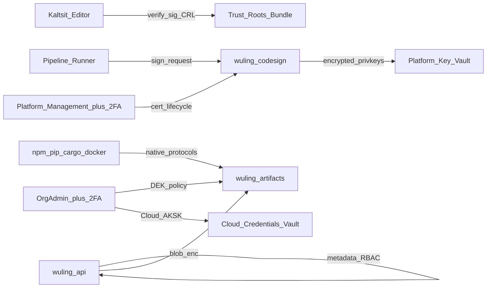

# 统一供应链与密钥安全架构

> 状态：**设计提案 / 非实现**。日期：2026-08-08。  
> 范围：武陵 DevOps 平台侧供应链信任、制品协议、Release、密钥分层与 IAM/2FA；不改业务代码。  
> 依赖与承接：
>
> - 编辑器消费方：Kaltsit-Esperanta `.factory/prompts/discussions/unified-security-architecture.md` §6（扩展签名 / 发布者白名单 / 撤销与离线验签；与本仓为兄弟目录时相对路径为 `../../Kaltsit-Esperanta/.factory/prompts/discussions/unified-security-architecture.md`）
> - 现状基线：[artifacts.md](artifacts.md)、[auth.md](auth.md)、[pipelines.md](pipelines.md) §4 Secrets、[RELEASE.md](RELEASE.md)（**本仓自身** git-tag 发版，与产品 Release 无关）
> - 路线图：[dev-plan.md](../dev-plan.md) Stage 2（原生协议适配仍为下一步）
>
> 核心约束：**多根信任、密钥域分离、高敏操作强制 2FA**。不得用单一 CA / 单一主密钥 / Secrets 一把梭替代分层控制。

---

## 0. 一句话结论

用单一平台供应链信任面承接 Kaltsit 的 `medium+` 验签要求：新增 **`wuling-codesign`**（多根签发 / 吊销 / trust-bundle），增强 **`wuling-artifacts`**（真实 npm/PyPI/Cargo 协议 + OCI Distribution + 可选透明加密），把产品 **Release** 做到 GitHub Releases 级（assets / draft→publish / latest），并把密钥拆成三域——**Secrets（CI） / Cloud Credentials（云 AK/SK） / Signing Keys（证书私钥）**——分别由 **OrgAdmin+2FA** 与 **Platform Management（强制 2FA）** 门禁。

### 0.1 非目标

- 不在本文实现 Kaltsit / Logos 编辑器验签钩子（只定义平台签发与信任分发契约）。
- 不替代 Agent OS 沙箱或 `security.level`（见 Kaltsit 讨论稿）。
- 不把 CI job artifact（流水线产物）与 Package Registry / OCI 混为一谈。
- 不要求所有签名经过单一商业 CA；不把「经 Wuling 控制面签发」等同于「只有一把根」。

---

## 1. 现状基线（2026-08）

```text
wuling-api：Package / Version / Release 元数据 + Secrets(AES-GCM 单钥) + Org RBAC(owner ≈ 管理)
wuling-artifacts：不可变 Blob（local / S3 / R2 / OSS）

缺口：无代码签名服务；npm / PyPI / Cargo / Docker 仅 kind 标签；Release 无 assets；
      无透明加密；云 AK/SK 塞在 org Secret；无 OrgAdmin / Platform Management / 2FA / 恢复密钥
```

| 域 | 现状 | 引用 |
|----|------|------|
| Artifact Blob | 已拆微服务：`wuling-api` 元数据 + `wuling-artifacts` Blob；手动 multipart 上传 | [artifacts.md](artifacts.md)、`cmd/wuling-artifacts`、`internal/artifactblob/` |
| Package Registry | `kind ∈ {npm,pypi,cargo,docker,logos}` + 单文件 version blob；**无**原生协议端点 | `0011_stage2_core.up.sql`、`internal/stage2http/` |
| 产品 Release | `project_releases`：tag/name/notes/prerelease/publish；**无** asset 表 | 同上 |
| Secrets | AES-256-GCM，`WULING_SECRETS_KEY`；maintainer+ 可写 | [pipelines.md](pipelines.md) §4 |
| 云 AK/SK | `credentials_secret` → org Secret JSON（与 Secrets **刻意合一**） | [pipelines.md](pipelines.md) §4、`internal/autoscale/` |
| IAM | Org：owner/maintainer/developer/reporter/guest；`CanAdminOrg` = owner；实例 `users.is_admin` | `internal/auth/roles.go`、[auth.md](auth.md) |
| 代码签名 | 无服务；[RELEASE.md](RELEASE.md) 仅预留 cosign/SLSA 想象 | — |
| 编辑器验签 | 仅 Kaltsit 设计：manifest + 发布者 + 版本 + 包摘要；CRL/过期/离线 fail-closed | Kaltsit §6 |

---

## 2. 威胁模型

### 2.1 资产

| 资产 | 为何重要 |
|------|----------|
| 扩展 / 包 / 镜像供应链 | 恶意或篡改制品可进入开发者主机与生产集群 |
| 代码签名证书私钥 | 泄露即可持续签发「看起来合法」的扩展与附件 |
| 信任根与 CRL | 决定客户端是否接受更新；被垄断或被胁迫吊销可造成供应链瘫痪 |
| 制品明文（Blob） | 未加密对象存储泄露即源码 / 二进制外泄 |
| 云 AK/SK | 可拉起 Runner、读写云资源；等同组织云账单与数据面钥匙 |
| 组织 / 平台主密钥与恢复密钥 | 解开透明加密与证书密封的根；丢失即数据不可恢复，泄露即全域失守 |

### 2.2 攻击者与场景

1. **地缘政治 / 胁迫吊销**：第三方或上游被迫吊销 **Zed Industries** 证书或根。若客户端只信单一根或「必须经某一垄断 CA」，全平台扩展安装与更新停摆。目标：**多根集合**中其余根（如 Zixiao / Wuling）仍可独立签发与验签。
2. **反向冒充**：Zixiao 根泄露后，攻击者签发假「Zed」身份。目标：吊销粒度到根 / 中间证 / 发布者证；**一根基泄露不得自动信任另一根身份**。
3. **单 CA 垄断**：所有签名强制经过同一商业或组织 CA，运营方或敌对方可单方面拒绝签发或批量吊销。
4. **密钥明文或混存**：证书私钥、云 AK/SK、CI Secret 共用同一 Secrets 表与同一主密钥；maintainer 即可改云钥或触及签名材料。
5. **无 2FA 的高敏操作**：组织主密钥生成、恢复密钥出示、透明加密开关、证书生命周期仅凭密码会话完成。
6. **制品篡改 / 调包**：签名与包内容分离；或 Registry 协议面允许覆盖已发布版本（违背不可变）。
7. **半信任运营**：实例管理员可在未 2FA 时导出平台签名私钥。

### 2.3 非目标（本设计不承诺）

- 防止有权的 OrgAdmin 在通过 2FA 后恶意关闭加密或轮换密钥（靠审计与双人制可选演进，非本版硬性）。
- 在客户端对抗已安装、已验签恶意扩展的运行时行为（能力闸门属 Kaltsit）。
- 替代对象存储供应商的物理安全与合规认证。

---

## 3. 分层防御与服务边界

```text
┌──────────────────────────────────────────────────────────────────────────┐
│  IAM / 2FA 门禁   OrgAdmin（组织高敏） · Platform Management（平台高敏）   │
├──────────────────────────────────────────────────────────────────────────┤
│  信任层  wuling-codesign：多根 · 签发 · CRL/状态 · trust-bundle           │
├──────────────────────────────────────────────────────────────────────────┤
│  制品层  wuling-artifacts：Blob · 协议适配 · OCI · 透明加密（信封）         │
├──────────────────────────────────────────────────────────────────────────┤
│  控制面  wuling-api：元数据 · RBAC · Release · 编排签发与下载授权           │
├──────────────────────────────────────────────────────────────────────────┤
│  密钥域  Secrets(CI)  ≠  Cloud Credentials(AK/SK)  ≠  Signing Keys(证书) │
└──────────────────────────────────────────────────────────────────────────┘
```



| 服务 / 域 | 职责（目标态） | 部署备注 |
|-----------|----------------|----------|
| **`wuling-codesign`**（新） | 证书与密钥生命周期；签发扩展包 / 可选 OCI 与 Release 签名附件；CRL 或等价状态；trust-bundle 分发；平台私钥密封 | 独立进程；私钥永不进入 `wuling-api` 明文内存（除受控签署 RPC） |
| **`wuling-artifacts`**（增强） | 不可变 Blob；npm / PyPI / Cargo 协议适配；OCI Distribution；透明加密加解密路径 | 保持独立扩容；协议入口可经 API 网关反代 |
| **`wuling-api`** | Package / Release 元数据、项目 RBAC、上传授权、触发签署、协议鉴权编排 | 不持久化证书私钥；不把云 AK/SK 权威存在 Secrets |
| **Cloud Credentials 域** | Autoscaler 等云 AK/SK；独立表 + 独立 KEK | 可先同进程逻辑隔离，后可拆服务 |
| **Secrets**（保持） | CI 通用机密 | **禁止**再作为云 AK/SK 与签名私钥的权威存储 |

内部信任：`wuling-api` → `wuling-artifacts` / `wuling-codesign` 继续用短寿命内部 Bearer 或 mTLS（实现期选定，文档要求：**浏览器永不持有**内部令牌）。

---

## 4. 代码签名微服务（`wuling-codesign`）

对接 Kaltsit §6：编辑器安装时 fail-closed 验签；平台提供签发、信任根与撤销信息。

### 4.1 签名必须绑定（缺一即失败）

与编辑器契约一致，签名载荷至少绑定：

1. **规范化 manifest**（稳定序列化后的声明内容）
2. **发布者身份**（publisher id / 显示名，与证书 SAN 或扩展字段一致）
3. **扩展 / 包版本**
4. **内容摘要**（安装产物 SHA-256 或等价 digest；防「签名与包分离替换」）

可选附件（同一次签署事务内）：能力声明摘要、源项目 id、构建 run id（provenance 轻量字段；完整 SLSA 另立）。

### 4.2 多根信任模型（反垄断）

**问题**：若全球或本平台只承认一把根（或强制所有发布者挂在同一中间 CA 下），地缘政治或上游胁迫吊销 **Zed Industries** 相关证书时，依赖该链的客户端会集体无法安装 / 更新——即使 Zixiao 侧密钥与运营完好。

**规则（设计钉死）**

| 主题 | 规则 |
|------|------|
| 信任锚 | 客户端（Kaltsit / Logos）与 `GET /v1/trust-bundle` 分发 **多根集合**，而非单一根 |
| 最小并行根角色 | 至少可运营：`Zixiao Palace Laboratory Group`、`Zed Industries Inc`；允许追加第三根（客户企业根等） |
| `require_wuling` 语义 | 表示「签名由 Wuling 控制面认可的签发路径产生，且链上根 ∈ 当前信任包」；**不等价于「唯一 CA」** |
| 签发主权 | 各根的私钥与运营角色独立；Wuling 可托管多根的密封私钥，但吊销与轮换按根隔离审计 |
| 交叉承认 | 平台同时分发多根；**不得**要求所有签名必须经过单一商业 CA；平台自签与第三方根并行 |
| 吊销粒度 | 发布者叶证书 → 中间 CA → 整根；吊销 Zed 根 **不得**使 Zixiao 链上未撤销签名失效 |
| 根泄露 | 仅失效该根链；不得「自动改签」到另一根身份；已安装策略遵循 Kaltsit（拒绝新装 / 更新，已装可只跑不更新） |
| 轮换 | 新中间证经根签发后可验；轮换窗口可短暂双认；过期后旧钥只校验**已安装**版本，不授权新装 |
| 离线 | 编辑器使用本地信任包 + 缓存撤销快照；无网不得跳过验签；快照过期时 `medium+` fail-closed |

**验收场景（必须可演练）**：从 trust-bundle 移除或吊销 Zed 根后，仅含 Zixiao 链签名的 Logos 扩展在 Kaltsit `high` 白名单策略下仍验签成功；仅含已吊销链的包 fail-closed。

### 4.3 发布者与 Logos Registry

- `kind=logos` 的版本发布流水线：上传 Blob → 计算 digest → 调用 codesign → 将签名与证书链元数据写入 version `metadata`（或并列 `signature` 对象）→ 编辑器按 Kaltsit §6.3 安装。
- `high+` 默认白名单发布者与 Kaltsit 对齐：`Zixiao Palace Laboratory Group`、`Zed Industries Inc`（可配置追加）。
- npm / OCI / Release assets 的签名为可选增强：同一签署 RPC，不同 `artifact_kind`。

### 4.4 API 草图（目标态，非现网）

基础前缀建议：`https://{host}/codesign/v1`（或内部 `wuling-codesign:port/v1`，经 API 网关暴露只读 trust/CRL）。

| 方法 | 路径 | 谁可调用 | 作用 |
|------|------|----------|------|
| `GET` | `/v1/trust-bundle` | 公开 / 编辑器 | 当前多根证书包 + 世代号 + 过期时间 |
| `GET` | `/v1/crl` 或 `/v1/revocation` | 公开 / 编辑器 | 撤销列表或状态查询（含快照世代） |
| `POST` | `/v1/sign` | `wuling-api` / 授权 CI（项目 developer+ 且流水线声明） | 对 digest+绑定字段签署；返回签名与链 |
| `POST` | `/v1/roots` | **Platform Management + 2FA step-up** | 注册 / 激活根或中间证 |
| `POST` | `/v1/roots/{id}/rotate` | 同上 | 轮换 |
| `POST` | `/v1/revoke` | 同上（叶证可委托组织发布者管理员，见实现期） | 吊销 |
| `GET` | `/healthz` | 探针 | 不暴露密钥材料 |

`POST /v1/sign` 请求体（逻辑字段）：

```json
{
  "artifact_kind": "logos",
  "publisher": "Zixiao Palace Laboratory Group",
  "version": "1.2.3",
  "content_digest": "sha256:…",
  "manifest_canonical": "…",
  "key_alias": "zixiao-extensions-leaf-2026"
}
```

失败语义：未知 publisher、digest 与已存 Blob 不一致、证书已撤销 / 过期、调用方无权 → **拒绝签署**，不得返回半签名。

### 4.5 证书私钥密封

- 私钥仅以密封形式存在于 **Platform Key Vault**（进程内密封存储或外接 KMS；实现可选，语义一致）。
- 明文私钥 **永不**写入 Postgres、Logs、Secrets API、对象存储用户可见前缀。
- 签署时在 codesign 进程内短暂解封或经 KMS 签名接口；审计记录 `key_alias`、digest、caller、结果，不记录密钥材料。
- 平台主密钥与恢复密钥见 §6.3。

---

## 5. Artifacts：原生协议、OCI 与 Release

在现有「单文件 version blob + 手动上传」之上演进；Blob 不可变与加密策略仍由 `wuling-artifacts` + 组织密钥策略执行。协议适配可挂在 `wuling-api` 网关或 artifacts 边车，但对客户端呈现稳定 registry URL。

### 5.1 协议目标

| 协议 | 目标行为 | 现状差距 |
|------|----------|----------|
| **npm** | 兼容 publish / install；scope 与 token；metadata 与 tarball | 仅 kind + 单文件 |
| **PyPI** | Simple API + Warehouse 兼容上传（twine）；pip / uv / poetry 可装 | 同上 |
| **Cargo** | sparse index + `cargo publish` 兼容 | 同上 |
| **Docker / OCI** | **OCI Distribution Spec** 最低集：blobs、manifests、tags、（建议）referrers | `kind=docker` 仅为标签 |
| **Logos** | 扩展包 + codesign 元数据；供 marketplace / 编辑器 | 无签名字段 |
| **Release** | 对齐 **GitHub Releases** | 无 assets |

### 5.2 OCI 最低能力集（设计）

必须支持：

- 内容寻址 blob：`PUT/GET /v2/<name>/blobs/...`
- manifest 按 digest / tag 读写
- 标签列表与删除策略（删除须项目权限；**digest 不可变**，tag 可移动须审计）
- 鉴权：Bearer（项目 token 或 session 兑换的 registry token）
- 与透明加密：密文存盘；经授权 pull 时解密流式返回（客户端仍看到标准 OCI 字节）

诚实边界：不是完整「云厂商容器服务」替代品；镜像扫描 / 签名策略（cosign 互操作）可在 P3+ 追加，但 **Distribution 协议本身**不得用「上传一个 tar 到 package version」冒充。

### 5.3 产品 Release（GitHub Releases 级）

与 [RELEASE.md](RELEASE.md)（武陵 DevOps **本仓库** CI 发版）无关；此处指项目内 `project_releases`。

| 能力 | 目标 |
|------|------|
| 元数据 | tag、name、notes（Markdown）、prerelease、draft |
| 生命周期 | 创建 draft → 挂 assets → publish（写 `published_at`）；已 publish 可标 prerelease |
| **Assets** | 多文件；每文件独立 Blob key、size、content-type、sha256；可选 codesign 签名附件 |
| **latest** | 解析「最新非 prerelease 且已 publish」；API / UI / 可选 `.../releases/latest` |
| 权限 | 写：developer+；公开项目读 assets 按项目可见性；私有需成员或 token |
| 不可变 | 已 publish 的 asset 字节不可改；替换 = 新文件名或新 release |

目标表（逻辑）：`project_release_assets(release_id, name, blob_key, size_bytes, sha256, content_type, signature_metadata)`。

### 5.4 与手动上传的兼容

- Stage 2.3 手动 multipart 上传保留为「通用 / Logos / 应急」路径。
- 原生协议 publish 成功后写入同一 `artifact_package_versions`（或 OCI 专用表），共享权限与加密策略。
- 版本不可变：已发布 version / digest **禁止覆盖**；重发须 bump 或重新 tag。

---

## 6. 密钥分层与透明加密

### 6.1 三域分离

| 域 | 保护对象 | 主密钥 / 恢复 | 谁可配置 | 2FA |
|----|----------|---------------|----------|-----|
| **Secrets**（现有） | CI 通用机密 | 实例级 `WULING_SECRETS_KEY`（可后续演进） | 现有 maintainer+ 等 | 本设计不强制；保持现状 |
| **Artifacts 透明加密** | Blob DEK / 组织 KEK | **组织主密钥 + 恢复密钥** | **仅 OrgAdmin** | 生成 / 轮换 / 恢复 / 开关加密 **强制 2FA**（Microsoft Authenticator 或兼容 TOTP；WebAuthn 可选） |
| **Cloud Credentials** | 云 AK/SK（Autoscaler 等） | 组织级独立 KEK（**≠** Secrets 密钥） | **仅 OrgAdmin** | 同上 |
| **Signing Keys** | codesign 证书私钥 | **平台主密钥 + 恢复密钥** | **仅 Platform Management** | **登录该角色强制 2FA**；生成 / 恢复同样 step-up 2FA |

威胁→控制映射：

| 威胁 | 控制 |
|------|------|
| maintainer 可读改云 AK/SK | Cloud Credentials 移出 Secrets；仅 OrgAdmin+2FA |
| 对象存储桶泄露导致源码明文 | Org 级透明加密（信封）；关闭需 OrgAdmin+2FA |
| 实例管理员无 2FA 导出签名私钥 | Platform Management 强制 2FA；私钥密封 |
| 主密钥丢失全站无法解密 | 恢复密钥一次性出示 + 离线保管流程 |
| 单密钥打通所有域 | 三域 KEK 分离；禁止交叉解密 API |

### 6.2 Artifacts 透明加密（组织级）

**语义（选定默认）**：服务端信封加密。

- 每个对象（或每个 package）随机 DEK；DEK 由组织 KEK 封装；KEK 由组织主密钥保护。
- 客户端（npm / docker / 浏览器下载）无感：经授权会话由 `wuling-artifacts`（或 API 流式代理）解密后返回明文协议字节。
- **关闭**透明加密时行为与今日明文 Blob 兼容。
- **开启**后：
  - 新写入一律加密；
  - 旧对象：双读（先按密文头识别，失败则按明文）+ 后台重加密任务；完成前 UI 显示迁移进度。
- 组织主密钥生成、恢复密钥出示、KEK 轮换、加密开关：**仅 OrgAdmin**，且 API 要求有效 2FA challenge（TOTP 或已注册 WebAuthn）。

**恢复密钥**

- 生成主密钥时同时生成恢复密钥；UI **仅展示一次**（可分组 / 校验和），强制确认「已离线保存」。
- 恢复：OrgAdmin + 2FA + 恢复密钥 → 解封组织 KEK → 可选轮换主密钥并作废旧恢复密钥。
- 恢复与关闭加密均为破坏性操作：审计必记；建议冷却时间（实现期，如 1h）与二次确认文案。

### 6.3 证书私钥与平台主密钥

- 平台主密钥保护 Platform Key Vault 中的签名私钥密封层。
- 生成平台主密钥与恢复密钥：**仅 Platform Management**，强制 2FA；恢复密钥一次性出示。
- **Platform Management 登录**：未完成 2FA 注册或本会话未通过 2FA → **拒绝进入**该角色任何控制台与 API（含只读证书列表是否暴露实现期可收紧为「列表可见、材料不可见」；默认建议：**整角色会话拒绝**）。
- 恢复流程与组织侧对称，另加双人审批可作为 P4 增强（本版不强制）。

### 6.4 Cloud Credentials 域

- 独立存储（表或服务）：`provider`、`name`、密封 JSON、元数据；API **永不回显**明文。
- Autoscaler / runner-config 的 `credentials_secret` **迁移**为 `credentials_ref`（指向 Cloud Credentials 名）；过渡期可读旧 Secret 但 UI 标废弃。
- 创建 / 轮换 / 删除：仅 OrgAdmin + 2FA。
- maintainer 继续管理普通 CI Secrets，但 **不能**写入 Cloud Credentials。

---

## 7. IAM 模型演进

### 7.1 组织级：OrgAdmin

| 项目 | 设计 |
|------|------|
| 与现状关系 | 现网 `owner`（`CanAdminOrg`）映射为 **OrgAdmin** 能力集；文档与 UI 使用 OrgAdmin 名称，避免与项目「admin」混淆 |
| 独占能力 | 制品透明加密开关；组织主密钥 / 恢复密钥；Cloud Credentials CRUD；（可选）组织级 registry 强制签名策略 |
| 非独占 | 普通 Secrets、成员管理等可维持 maintainer / owner 现有分工；**不得**把高敏三项下放给 maintainer |
| 2FA | 行使独占能力时 **step-up 2FA**；建议 OrgAdmin 账号强制 enroll（实现期可配置「强制」） |

### 7.2 平台级：Platform Management

| 项目 | 设计 |
|------|------|
| 与现状关系 | 从 `users.is_admin` 演进 / 拆分：运营审批、OAuth app 等可留在「实例运营」；**证书根、平台主密钥、codesign 运营**归 **Platform Management** |
| 登录 | **强制 2FA**；未 enroll 不得登录该角色 |
| 独占能力 | trust 根与中间证、叶证策略、吊销、平台主密钥 / 恢复密钥、codesign 密钥别名 |
| 审计 | 所有证书与平台密钥事件写入不可篡改审计流（append-only 表或外送 SIEM） |

### 7.3 2FA 类型

- **必备兼容**：TOTP（Microsoft Authenticator、Google Authenticator 等 RFC 6238 应用）。
- **推荐**：WebAuthn / passkey 作为第二因素或替代因素（实现分期）。
- 备份码：与恢复密钥不同；备份码仅用于账号 2FA 丢失，**不能**代替组织 / 平台恢复密钥。

### 7.4 审计事件（最低集）

`org.master_key.generate` · `org.master_key.recover` · `org.artifact_encryption.enable|disable` · `org.cloud_credential.create|rotate|delete` · `platform.master_key.*` · `codesign.root.*` · `codesign.sign` · `codesign.revoke` · `release.publish` · `oci.tag.move`

---

## 8. 分期路线图

| 阶段 | 内容 |
|------|------|
| **P0** | 设计冻结；OrgAdmin / Platform Management 命名与 2FA 门禁；Cloud Credentials 与 Secrets **逻辑分离**；`wuling-codesign` 骨架 + trust-bundle / CRL；Kaltsit 验签钩子可对接测试根 |
| **P1** | 多根签发与吊销演练（「吊销 Zed 根后 Zixiao 链仍可用」）；Logos 扩展签名闭环 |
| **P2** | npm / PyPI / Cargo 原生协议 + 配置指南；Release assets + latest |
| **P3** | OCI Distribution；Artifacts 透明加密（OrgAdmin+2FA）；平台证书私钥密封 + 恢复密钥 |
| **P4** | Autoscaler 切到 Cloud Credentials；废弃「AK/SK 存 Secrets」；可选 WebAuthn / 双人审批 |

---

## 9. 验收标准（设计级）

进入各阶段实现前须可勾选；实现后须可自动化或演练证明：

1. **反垄断**：吊销或移除 Zed 根后，仅 Zixiao 链签名的扩展在 `high` 白名单策略下仍可验证；仅 Zed 链且已吊销的包 fail-closed。
2. **OrgAdmin 门禁**：非 OrgAdmin，或 OrgAdmin 未通过 2FA challenge，无法设置透明加密、云 AK/SK、组织主密钥 / 恢复密钥。
3. **Platform Management 门禁**：非该角色，或未 2FA，无法登录该角色控制台 / 调用证书私钥与根生命周期 API。
4. **协议**：对私有 registry，`npm install` / `pip install` / `cargo add` / `docker pull` 存在可复制配置指南（附录 A）且路径与鉴权可用。
5. **Release**：同一 release 可挂多个 assets；可解析 latest；可选签名附件。
6. **密钥域**：云凭证权威路径不再落在 Secrets API；签名私钥不出现在 Secrets 或制品元数据明文中。
7. **Kaltsit 绑定**：签署产物含规范化 manifest + 发布者 + 版本 + content digest；缺一验签失败。
8. **恢复**：组织与平台恢复密钥均仅展示一次；恢复操作写审计且需 2FA。

---

## 10. 相关路径速查

| 路径 | 角色 |
|------|------|
| `cmd/wuling-artifacts/` | Artifact Blob 服务入口 |
| `cmd/wuling-api/` | 控制面（未来编排 codesign / 协议网关） |
| `internal/artifactblob/` | 存储适配 |
| `internal/artifactclient/` | API → Artifacts 内部客户端 |
| `internal/stage2http/` · `internal/stage2store/` | Package / Release CRUD 与上传 |
| `internal/secretbox/` · `internal/secretstore/` | Secrets 密封（不承接 AK/SK 权威） |
| `internal/autoscale/` | 云凭证消费方（将改读 Cloud Credentials） |
| `internal/auth/roles.go` | Org RBAC；OrgAdmin 能力将叠加于此 |
| `frontend/.../artifacts.tsx` · `secrets*.tsx` · `pages/admin/*` | 制品 / Secrets / 实例运营 UI |
| Kaltsit `crates/ama10/` | 编辑器 Wuling 客户端（信任锚候选） |

---

## 附录 A. 客户端配置指南（提纲 / 目标态）

以下 `{base}` 为实例公网原点，例如 `https://wuling.example.com`。`{org}` / `{project}` 为 slug。token 为项目或组织 registry token（实现期定义；**不是**内部 Blob Bearer）。

### A.1 npm

```ini
# ~/.npmrc 或项目 .npmrc
@{scope}:registry={base}/registry/npm/{org}/{project}/
{base}/registry/npm/{org}/{project}/:_authToken=${WULING_NPM_TOKEN}
always-auth=true
```

```bash
npm publish --registry "{base}/registry/npm/{org}/{project}/"
npm install @scope/pkg --registry "{base}/registry/npm/{org}/{project}/"
```

### A.2 PyPI

```ini
# pip.conf / environment
[global]
extra-index-url = https://__token__:${WULING_PYPI_TOKEN}@{host}/registry/pypi/{org}/{project}/simple/
```

```bash
twine upload --repository-url "{base}/registry/pypi/{org}/{project}/" dist/*
pip install <pkg> --extra-index-url "https://__token__:…@…"
```

### A.3 Cargo

```toml
# .cargo/config.toml
[registries.wuling]
index = "sparse+{base}/registry/cargo/{org}/{project}/"
```

```bash
cargo publish --registry wuling
cargo add <crate> --registry wuling
```

### A.4 Docker / OCI

```bash
echo "$WULING_REGISTRY_TOKEN" | docker login "{host}" -u "{username}" --password-stdin
docker tag local:img "{host}/oci/{org}/{project}/{name}:{tag}"
docker push "{host}/oci/{org}/{project}/{name}:{tag}"
docker pull "{host}/oci/{org}/{project}/{name}:{tag}"
```

### A.5 Logos 扩展

- 发布：CI 或 UI 上传 → 自动 / 显式 `codesign` → version metadata 含签名。
- 安装：编辑器按 Kaltsit `security.level` 拉取 trust-bundle + 验签；`medium` 要求 Wuling 认可路径；`high+` 另检发布者白名单。

---

## 附录 B. OpenAPI / 内部 RPC 端点清单（目标态）

### B.1 Codesign（见 §4.4）

对外只读：`GET /codesign/v1/trust-bundle`、`GET /codesign/v1/crl`。  
签署与根运营：内部或经 `wuling-api` 反代并做 RBAC / 2FA。

### B.2 Cloud Credentials（经 `wuling-api`）

| 方法 | 路径 | 权限 |
|------|------|------|
| `GET` | `/api/v1/orgs/{org}/cloud-credentials` | OrgAdmin（列表无明文） |
| `PUT` | `/api/v1/orgs/{org}/cloud-credentials/{name}` | OrgAdmin + 2FA |
| `DELETE` | `/api/v1/orgs/{org}/cloud-credentials/{name}` | OrgAdmin + 2FA |

### B.3 组织加密策略

| 方法 | 路径 | 权限 |
|------|------|------|
| `GET` | `/api/v1/orgs/{org}/artifact-encryption` | OrgAdmin |
| `POST` | `/api/v1/orgs/{org}/artifact-encryption/enable` | OrgAdmin + 2FA |
| `POST` | `/api/v1/orgs/{org}/artifact-encryption/disable` | OrgAdmin + 2FA |
| `POST` | `/api/v1/orgs/{org}/master-key/generate` | OrgAdmin + 2FA（返回一次性恢复密钥） |
| `POST` | `/api/v1/orgs/{org}/master-key/recover` | OrgAdmin + 2FA + 恢复密钥 |

### B.4 Release assets

| 方法 | 路径 | 权限 |
|------|------|------|
| `POST` | `.../releases/{id}/assets` | developer+ |
| `GET` | `.../releases/{id}/assets/{name}` | 按项目可见性 |
| `GET` | `.../releases/latest` | 按项目可见性 |

### B.5 Registry 网关（示意）

- `/registry/npm/{org}/{project}/...`
- `/registry/pypi/{org}/{project}/...`
- `/registry/cargo/{org}/{project}/...`
- `/v2/...`（OCI；路径与 org/project 映射实现期定）

---

## 附录 C. 与 Kaltsit `extension_signing` / `security.level` 映射

| Kaltsit `security.level` | 平台侧期望 |
|--------------------------|------------|
| `none` / `low` | 可不验签或警告；平台仍可提供签名供自愿校验 |
| `medium` | 必须通过 **Wuling 认可签发路径**（`require_wuling`）；信任包为多根 |
| `high` / `extreme` / `ultra` | 验签 + 发布者 ∈ 白名单（默认 Zixiao + Zed）；吊销 / 过期 fail-closed |
| `custom.extension_signing.mode` | `off` / `warn_unsigned` / `require_wuling` / `allowlist_publishers` 与上表对齐 |

| Kaltsit 概念 | Wuling 提供 |
|--------------|-------------|
| 信任根 | `GET /codesign/v1/trust-bundle`（多根） |
| 撤销快照 | `GET /codesign/v1/crl`（含世代与过期） |
| 包摘要绑定 | 签署前校验 Blob sha256；签名含 `content_digest` |
| 发布者白名单 | 证书 / 元数据中的 publisher；编辑器本地列表 |

`crates/ama10` 为编辑器侧候选客户端：消费 trust-bundle / 下载扩展，**不**持有平台签名私钥。

---

## 附录 D. 迁移：Secrets 中的云 JSON → Cloud Credentials

1. **P0**：新增 Cloud Credentials API 与表；UI 引导 OrgAdmin 创建；`credentials_ref` 与旧 `credentials_secret` 双读。
2. **双读语义**：池配置优先 `credentials_ref`；缺省时回落 org Secret 名（记 warning 指标）。
3. **P4**：拒绝新池使用 `credentials_secret`；提供迁移工具一次性把指定 Secret 导入 Cloud Credentials 并删除 Secret 中的 AK/SK 值（或替换为占位提示）。
4. **权限收紧**：导入后仅 OrgAdmin 可轮换；原 maintainer 对 Secrets 的写权限不再覆盖该材料。
5. **文档**：更新 [pipelines.md](pipelines.md) §4，删除「云凭证即 Secret」作为推荐路径；保留历史说明并指向本文。

---

## 附录 E. 术语

| 术语 | 含义 |
|------|------|
| OrgAdmin | 组织最高敏感管理能力；现网 `owner` 映射 |
| Platform Management | 平台级证书与平台主密钥运营角色；强制 2FA 登录 |
| trust-bundle | 多根证书与元数据快照，供客户端离线验签 |
| 透明加密 | 服务端信封加密 Blob，协议客户端无感 |
| Cloud Credentials | 独立于 Secrets 的云 AK/SK 域 |
| `require_wuling` | 经 Wuling 控制面认可的多根签发路径，非单 CA |
|
